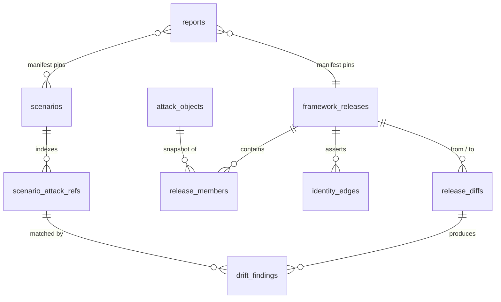

# Engineering Plan v2: ATT&CK Knowledge Pipeline for Liszt
### Release-pinned identity, drift detection, and reproducible reporting on MongoDB

---

## 0. What v2 adds

| Concern | v1 approach | v2 approach |
|---|---|---|
| Technique identity | `matrix_id` (T-number) | STIX id (`attack-pattern--<uuid>`); the T-number becomes a per-release label |
| Version axis | Ingestion time (`is_current`, `valid_from/to`) | Framework release (`enterprise-attack@7.0`) plus ingestion time (bitemporal) |
| Framework source | Notion database | MITRE STIX 2.x bundles from `mitre-attack/attack-stix-data` |
| Notion role | Primary data | Curated overlay: POC references, emulation plans, actor tags, mitigations |
| Change detection | Content hash per `matrix_id` | Release-to-release diff keyed on STIX id, with classes `added`, `revoked`, `deprecated`, `modified`, `unchanged` |
| Lineage | Implicit | `identity_edges` graph built from STIX `revoked-by` and `subtechnique-of` relationships |
| Impact analysis | Out of scope | Reverse index from technique to scenario step, plus a `drift_findings` work queue |
| Reproducibility | Out of scope | Immutable inputs addressed by hash, report manifests, pinned renderer image, output hash verification |

---

## 1. Sources

### 1a. MITRE STIX bundles (framework truth)
One bundle per domain per release, pulled from `github.com/mitre-attack/attack-stix-data` (confirm exact file paths during Step 2). The raw bundle bytes land in blob storage with a SHA-256, and stay immutable forever. Every downstream record traces back to one bundle hash.

### 1b. Notion "ATTCK Data" (curated overlay)
Data source `collection://5c2aa5cc-1ca1-4742-bf5d-57d55fa8507d`. Observed properties:

| Property | Type | Pipeline use |
|---|---|---|
| Name | title | Overlay display name |
| Tags | multi_select | Mixed bag: tactic names, `T`/`TA` ids, actor names (`APT28`, `G0007`), platforms (`Enterprise`, `Mobile`), plan kinds (`Emulation Plan`, `Custom Plan`), themes (`Ransomware`, `Russia`) |
| MITRE ATT&CK Reference | url | Primary join key to a STIX object (parse `/techniques/T1059/001/`) |
| Mitigation | url | Join to `course-of-action` objects |
| POC Reference | text | Overlay payload, classification-sensitive |
| Parent Project | url | Overlay grouping |
| Time of Change | last_edited_time | Curation transaction time (distinct from framework release) |
| Last edited by | last_edited_by | Audit trail |

**Tag normalization.** Split each tag into typed buckets with shape rules:

```
^TA\d{4}$              -> tactic id
^T\d{4}(\.\d{3})?$     -> technique / sub-technique id
^G\d{4}$               -> group id
known tactic names     -> tactic shortname
Enterprise|Mobile|ICS  -> domain
Emulation Plan|Custom Plan -> plan_kind
everything else        -> free label
```

Tags outside those shapes route to `ingest_quarantine` with a suggested fix. Current candidates: `T1098.00`, `T1592.01` through `T1592.04` (likely `T1592.001`..`.004`), `TA001` (likely `TA0001`), `T206`.

---

## 2. Data model



### 2.1 `framework_releases`
```js
{
  _id: "enterprise-attack@7.0",
  domain: "enterprise-attack",
  version: "7.0",
  predecessor: "enterprise-attack@6.3",
  released_at: ISODate("2020-07-08T00:00:00Z"),
  source: {
    uri: "https://raw.githubusercontent.com/mitre-attack/attack-stix-data/<ref>/enterprise-attack/enterprise-attack-7.0.json",
    git_ref: "<commit sha>",
    sha256: "<bundle hash>",
    blob_ref: "s3://attck-bundles/enterprise-attack/7.0/<sha256>.json"
  },
  counts: { "attack-pattern": 0, "x-mitre-tactic": 0, "relationship": 0 },
  ingest_run_id: "run-…",
  ingested_at: ISODate("…"),
  status: "sealed"            // staging -> sealed; sealed releases are read-only
}
```

### 2.2 `attack_objects` (immutable, content-addressed)
One document per distinct object state. Unchanged objects share a hash across releases, so storage grows only with real edits.

```js
{
  _id: "sha256:<RFC 8785 canonical JSON hash of raw>",
  stix_id: "attack-pattern--<uuid-of-T1086>",
  stix_type: "attack-pattern",
  kind: "technique",          // tactic | technique | subtechnique | group | software | mitigation | procedure
  external_id: "T1086",
  name: "PowerShell",
  modified: ISODate("…"),
  x_mitre_version: "…",
  revoked: false,
  deprecated: false,
  parent_stix_id: null,
  tactic_shortnames: ["execution"],
  platforms: ["Windows"],
  description: "…",
  raw: { /* full STIX object, canonical form */ }
}
```

### 2.3 `release_members` (the release axis)
```js
{
  _id: { r: "enterprise-attack@7.0", s: "attack-pattern--<uuid-of-T1086>" },
  release_id: "enterprise-attack@7.0",
  stix_id: "attack-pattern--<uuid-of-T1086>",
  external_id: "T1086",
  object_hash: "sha256:…",
  state: "revoked"            // active | revoked | deprecated
}
```
Indexes: `{release_id:1, external_id:1}`, `{stix_id:1, release_id:1}`.

### 2.4 `identity_edges` (lineage graph)
```js
{
  _id: ObjectId(),
  release_id: "enterprise-attack@7.0",
  kind: "revoked_by",         // revoked_by | subtechnique_of | deprecated_no_successor | split_into | merged_into
  from: { stix_id: "attack-pattern--<uuid-of-T1086>",    external_id: "T1086" },
  to:   { stix_id: "attack-pattern--<uuid-of-T1059.001>", external_id: "T1059.001" },
  evidence: { source: "mitre_bundle", stix_relationship_id: "relationship--…" },
  confidence: 1.0             // 1.0 from MITRE; < 1.0 for analyst or heuristic edges
}
```
Unique index: `{release_id:1, kind:1, "from.stix_id":1, "to.stix_id":1}`.

### 2.5 `release_diffs`
```js
{
  _id: "enterprise-attack@6.3..enterprise-attack@7.0",
  from: "enterprise-attack@6.3",
  to: "enterprise-attack@7.0",
  algo_version: "diff/1.0",
  summary: { added: 0, revoked: 0, deprecated: 0, modified: 0, unchanged: 0 },
  revoked: [
    { stix_id: "attack-pattern--<uuid-of-T1086>", external_id: "T1086",
      successors: [{ stix_id: "attack-pattern--<uuid-of-T1059.001>", external_id: "T1059.001" }] }
  ],
  deprecated: [],
  added: [ { stix_id: "attack-pattern--<uuid-of-T1059.001>", external_id: "T1059.001" } ],
  modified: [ { stix_id: "…", external_id: "…", changed_paths: ["x_mitre_platforms", "kill_chain_phases"] } ],
  computed_at: ISODate("…")
}
```

### 2.6 `scenarios` (Liszt, immutable revisions)
```js
{
  _id: { scenario_id: "LSZ-0142", rev: 3 },
  scenario_id: "LSZ-0142",
  rev: 3,
  is_head: true,
  framework_pin: "enterprise-attack@6.3",
  content_hash: "sha256:…",
  steps: [
    { step_id: "s4", order: 4, action: "Encoded PowerShell download cradle",
      attack_ref: {
        stix_id: "attack-pattern--<uuid-of-T1086>",
        external_id_at_pin: "T1086",
        release_id: "enterprise-attack@6.3"
      },
      overlay_ref: "notion://page/<id>" }
  ],
  classification: { sensitivity: "Client-Confidential", owner: "…" },
  created_at: ISODate("…"),
  created_by: "…"
}
```
Partial unique index: `{scenario_id:1}` where `is_head: true`.

### 2.7 `scenario_attack_refs` (materialized reverse index)
Rebuilt inside the same transaction that writes a scenario revision.
```js
{ scenario_id: "LSZ-0142", rev: 3, is_head: true, step_id: "s4",
  stix_id: "attack-pattern--<uuid-of-T1086>", release_id: "enterprise-attack@6.3" }
```
Index: `{stix_id:1, is_head:1}`.

### 2.8 `drift_findings` (work queue)
```js
{
  _id: ObjectId(),
  diff_id: "enterprise-attack@6.3..enterprise-attack@7.0",
  scenario_id: "LSZ-0142", scenario_rev: 3, step_id: "s4",
  finding: "technique_revoked",   // technique_revoked | technique_deprecated | technique_modified | tactic_moved
  from: { stix_id: "attack-pattern--<uuid-of-T1086>", external_id: "T1086" },
  proposed: [ { stix_id: "attack-pattern--<uuid-of-T1059.001>", external_id: "T1059.001", basis: "revoked_by", confidence: 1.0 } ],
  auto_remap_eligible: true,      // true only for a single MITRE-asserted successor
  affected_reports: ["RPT-2026-Q3-ENT-01"],
  status: "open",                 // open | accepted | overridden | dismissed
  resolution: { by: null, at: null, choice: null, new_scenario_rev: null }
}
```
Unique index: `{diff_id:1, scenario_id:1, scenario_rev:1, step_id:1}` keeps reruns idempotent.

### 2.9 `reports` (manifest plus artifact)
```js
{
  _id: "RPT-2026-Q3-ENT-01",
  period: { from: ISODate("2026-07-01T00:00:00Z"), to: ISODate("2026-09-30T23:59:59Z") },
  manifest: {
    framework_release: "enterprise-attack@6.3",
    framework_bundle_sha256: "…",
    scenario_set: [ { scenario_id: "LSZ-0142", rev: 3, content_hash: "sha256:…" } /* ×N */ ],
    overlay_snapshot: { snapshot_id: "notion-2026-09-30T23:59:59Z", sha256: "…" },
    query_spec: { name: "q3_exec_summary", version: "4", sha256: "…" },
    template: { repo: "…/liszt-report-templates", git_sha: "…" },
    renderer: { image: "ghcr.io/<org>/liszt-report@sha256:…", lockfile_sha256: "…" },
    render_params: { format: "pdf", locale: "en_US", tz: "UTC", source_date_epoch: 1790812799 }
  },
  manifest_sha256: "…",
  output: { sha256: "…", bytes: 0, blob_ref: "s3://liszt-reports/2026/Q3/…pdf", retention: "object-lock" },
  generated_at: ISODate("…")
}
```

### 2.10 Supporting collections
`overlay_snapshots` (full Notion export per snapshot, hashed), `ingest_quarantine`, `ingest_runs` (run log with counts and timings).

### 2.11 Schema validation
`$jsonSchema` on `attack_objects` uses `oneOf` keyed on `kind`, so each shape enforces its own required fields (tactic → `x_mitre_shortname`; technique → `tactic_shortnames`, `platforms`; subtechnique → `parent_stix_id`; procedure → `actor_stix_id`, `technique_stix_id`). `validationAction: "error"` on every collection.

---

## 3. Round 1 walkthrough: T1086 → T1059.001

### 3.1 How the model represents framework versions and technique identity
* **Identity** lives in `stix_id`. MITRE keeps a STIX id stable for the life of an object, including after revocation.
* **The T-number** lives in `release_members.external_id`, scoped to one release. Lookups by T-number always carry a `release_id`.
* **Releases** are first-class rows in `framework_releases`, chained by `predecessor`.
* **Lineage** between identities lives in `identity_edges`.

For this case the store holds:

| Collection | Row |
|---|---|
| `release_members` | `(6.3, T1086-stix) state: active` |
| `release_members` | `(7.0, T1086-stix) state: revoked` |
| `release_members` | `(7.0, T1059.001-stix) state: active` |
| `identity_edges` | `7.0: T1086-stix -revoked_by-> T1059.001-stix` |
| `identity_edges` | `7.0: T1059.001-stix -subtechnique_of-> T1059-stix` |

Resolving "what does T1086 mean today" becomes a graph walk: start at the stix id, follow `revoked_by` edges release by release until reaching an `active` member of the target release.

### 3.2 How change detection finds the revocation and flags the 40 scenarios

**Pipeline stages (one `ingest_run`):**

1. **Fetch and seal the input.** Download the v7 bundle, compute SHA-256, write blob, insert `framework_releases` with `status: "staging"`.
2. **Load objects.** For each STIX object: canonicalize (RFC 8785), hash, `updateOne({_id: hash}, {$setOnInsert: doc}, upsert=True)`. Insert `release_members` rows.
3. **Extract lineage.** Every `relationship` with `relationship_type` of `revoked-by` or `subtechnique-of` becomes an `identity_edges` row. Objects with `x_mitre_deprecated: true` and zero successors become `deprecated_no_successor` edges.
4. **Diff by STIX id.**

```python
pipeline = [
  {"$match": {"release_id": {"$in": [FROM, TO]}}},
  {"$group": {
      "_id": "$stix_id",
      "states": {"$push": {"r": "$release_id", "h": "$object_hash",
                           "state": "$state", "xid": "$external_id"}}}},
  {"$project": {
      "old": {"$first": {"$filter": {"input": "$states", "cond": {"$eq": ["$$this.r", FROM]}}}},
      "new": {"$first": {"$filter": {"input": "$states", "cond": {"$eq": ["$$this.r", TO]}}}}}},
  {"$addFields": {"change": {"$switch": {"branches": [
      {"case": {"$not": ["$old"]}, "then": "added"},
      {"case": {"$and": [{"$eq": ["$old.state", "active"]}, {"$eq": ["$new.state", "revoked"]}]}, "then": "revoked"},
      {"case": {"$and": [{"$eq": ["$old.state", "active"]}, {"$eq": ["$new.state", "deprecated"]}]}, "then": "deprecated"},
      {"case": {"$ne": ["$old.h", "$new.h"]}, "then": "modified"}],
      "default": "unchanged"}}}},
]
```
   For `modified` rows, a Python pass computes `changed_paths` over semantic fields only (tactics, platforms, parent, name), with description edits tracked in a separate low-severity class. T1086 lands in `revoked`; the `identity_edges` lookup attaches T1059.001 under `successors`.

5. **Seal.** One multi-document transaction writes `release_diffs` and flips the release to `sealed`.
6. **Impact query.**

```python
revoked_ids = [r["stix_id"] for r in diff["revoked"]]
impact = db.scenario_attack_refs.aggregate([
  {"$match": {"stix_id": {"$in": revoked_ids}, "is_head": True}},
  {"$lookup": {
      "from": "reports",
      "let": {"sid": "$scenario_id", "rev": "$rev"},
      "pipeline": [{"$match": {"$expr": {"$in": [
          {"scenario_id": "$$sid", "rev": "$$rev"},
          {"$map": {"input": "$manifest.scenario_set",
                    "in": {"scenario_id": "$$this.scenario_id", "rev": "$$this.rev"}}}]}}},
                   {"$project": {"_id": 1}}],
      "as": "reports"}},
])
```
   The 40 scenarios surface here, each with the Q3 report ids that consumed them.

7. **Record findings.** Upsert one `drift_findings` row per (scenario, rev, step). `auto_remap_eligible` is `true` here because MITRE asserts exactly one successor. Split or merge cases (multiple successors) route to analyst review.
8. **Notify.** Emit to the chosen sink (Notion comment on the overlay row, Slack, or a Gitea issue) with counts and a link to the queue.
9. **Resolve.** Accepting a finding writes a **new** scenario revision (`rev: 4`, `framework_pin: "enterprise-attack@7.0"`, `attack_ref` → T1059.001) and flips `is_head` inside one transaction. Revision 3 stays byte-for-byte intact, which protects the Q3 report.

The same diff also runs against the Notion overlay: any overlay row whose reference URL resolves to a revoked stix id gets a finding with `scope: "overlay"`.

### 3.3 How someone regenerates the Q3 report a year later with byte-identical output

**Contract:** every input is immutable and addressed by hash; the renderer is a pinned image; the render process reads zero ambient state.

| Input | Pin |
|---|---|
| Framework data | `release_id` + bundle SHA-256 → `release_members` → `attack_objects` |
| Scenarios | `(scenario_id, rev, content_hash)` list |
| Overlay | `overlay_snapshots` id + SHA-256 |
| Query logic | `query_spec` name, version, SHA-256 |
| Layout | template git SHA |
| Toolchain | container image digest + lockfile hash (Python, fonts, PDF engine) |
| Clock and locale | `SOURCE_DATE_EPOCH`, `TZ=UTC`, fixed locale |

**Determinism rules for the renderer:**
* Explicit `sort` on every Mongo query and every Python iteration over dicts or sets.
* Timestamps printed in the report come from `source_date_epoch`.
* Fonts embedded from the image; PDF producer, creation date, and document id derived from the manifest hash.
* DOCX/XLSX outputs zipped with fixed entry order and fixed mtimes.
* Report-internal ids derived from content hashes.

**Rebuild flow:**
```bash
liszt report rebuild RPT-2026-Q3-ENT-01 --verify
```
1. Load `reports` row, recompute `manifest_sha256`, confirm match.
2. Pull the renderer image by digest.
3. Materialize datasets strictly from pinned ids (release membership for 6.3, scenario revs, overlay snapshot).
4. Render inside the container with `--network none`.
5. Compare output SHA-256 with `output.sha256`; exit non-zero with a structural diff on mismatch.

The archived artifact sits under object lock for delivery; the rebuild proves provenance. A nightly CI job rebuilds a rotating sample of historical reports to catch toolchain drift early.

---

## 4. Implementation plan for Claude Code

### 4.1 Stack
Python 3.11+, `pymongo` 4.x, `pydantic` v2, `httpx`, `loguru`, `typer`, `rfc8785` (canonical JSON), `pytest`, `testcontainers[mongodb]` running a single-node replica set for real transactions and `$jsonSchema` enforcement.

### 4.2 Layout
```
src/attck_pipeline/
  config.py
  canonical.py            # RFC 8785 canonicalization + sha256
  db/        setup.py  schemas.py  indexes.py  txn.py
  models/    stix.py  overlay.py  scenario.py  report.py
  sources/   mitre_stix.py  notion_overlay.py  tag_normalizer.py
  ingest/    loader.py  lineage.py
  diff/      engine.py  classify.py
  impact/    drift.py  notify.py
  scenarios/ revisions.py  remap.py
  reports/   manifest.py  render.py  rebuild.py
  cli.py
tests/
  fixtures/  enterprise_6_3_min.json  enterprise_7_0_min.json  scenarios_40.json  notion_rows.json
  test_schema_validation.py
  test_loader_idempotency.py
  test_lineage_edges.py
  test_diff_revocation.py
  test_impact_40_scenarios.py
  test_remap_revision.py
  test_report_rebuild_bytes.py
  test_tag_normalizer.py
```

### 4.3 Steps and acceptance criteria
1. **DB setup.** Collections, `$jsonSchema` validators with `oneOf` per kind, all indexes above. *Accept:* invalid shapes rejected per kind.
2. **STIX loader.** Fetch, hash, blob, `attack_objects` + `release_members`. *Accept:* loading the same bundle twice changes zero documents.
3. **Lineage.** `identity_edges` from relationships and deprecation flags. *Accept:* fixture yields `T1086 -revoked_by-> T1059.001` and `T1059.001 -subtechnique_of-> T1059`.
4. **Diff engine.** Aggregation plus semantic path diff; transactional seal. *Accept:* fixture diff lists T1086 under `revoked` with T1059.001 successor.
5. **Impact and findings.** Reverse-index query, report lookup, idempotent upserts. *Accept:* exactly 40 findings, each with `auto_remap_eligible: true` and the Q3 report id; rerun produces 40, still.
6. **Remap.** Accept a finding → new scenario revision in a transaction. *Accept:* rev 3 hash unchanged; rev 4 head points at T1059.001 under 7.0.
7. **Overlay ingest.** Notion export snapshot, tag normalizer, quarantine. *Accept:* `T1592.01`, `TA001`, `T206`, `T1098.00` land in quarantine with suggestions.
8. **Reports.** Manifest builder, deterministic renderer, `rebuild --verify`. *Accept:* two renders from one manifest, in separate processes on different days (freezegun), match SHA-256.

### 4.4 Prompt block for Claude Code
```
Implement the ATT&CK knowledge pipeline in docs/attck-pipeline-plan-v2.md.
1. Follow the layout in section 4.2 and the collection shapes in section 2 exactly.
2. Use STIX ids for identity; T-numbers are per-release labels in release_members.
3. Use RFC 8785 canonical JSON + SHA-256 for every content hash.
4. Use multi-document transactions for: release seal, scenario revision + reverse index rebuild, finding resolution.
5. Build minimal v6.3 and v7.0 fixtures where T1086 is revoked-by T1059.001, plus 40 scenarios referencing T1086 and a Q3 report manifest over them.
6. Tests run against testcontainers MongoDB (single-node replica set).
7. Deliver each step in section 4.3 with its acceptance test passing before starting the next.
```

---

## 5. Architecture decision questions

Answer these and the structure above narrows to the ideal fit. Each question lists the options and the structural consequence.

### A. Identity and scope
1. **Which ATT&CK domains belong in scope?** Enterprise only / + Mobile / + ICS.
   → Each domain gets its own release chain and diff stream; cross-domain scenarios need a multi-pin manifest.
2. **What serves framework truth?** MITRE STIX bundles / MITRE TAXII server / Notion.
   → STIX bundles give hashable, replayable inputs (recommended). TAXII adds live polling. Notion-sourced truth pushes identity onto T-numbers.
3. **Does the team author custom techniques or procedures (for example `T206`, internal emulation steps)?**
   → Yes: add a `x-c3s-*` STIX namespace with its own release chain and lineage edges.
4. **How do Liszt scenarios reference techniques today?** T-number strings / STIX ids / Notion page URLs / free text.
   → Determines the one-time backfill: T-number strings resolve against each scenario's original release to recover stix ids.

### B. Versioning semantics
5. **Release granularity?** Every minor (7.1, 7.2) / majors only.
   → Minors mean more diffs and smaller findings batches; majors mean fewer, larger batches.
6. **Pin scope?** Per scenario / per engagement / one pin for all of Liszt.
   → Per scenario gives the finest control and the most mixed-release reports; a global pin simplifies reports and forces bulk migrations.
7. **Remap policy?** Auto-accept single MITRE successors / always human review / auto-accept with post-hoc audit.
   → Drives `auto_remap_eligible` handling and approval roles.
8. **Scenario revision retention?** Forever / N years / until no report references the revision.
   → The third option needs a reference counter on revisions.
9. **Bitemporal queries?** Only "what did release X say" / also "what did our system believe on date D."
   → The second adds `recorded_from/recorded_to` on overlay and scenario rows.

### C. Change detection and operations
10. **Trigger?** Scheduled poll / GitHub release watch / manual CLI.
11. **Finding destination?** Notion comments / Slack / Gitea or Jira issues / in-app queue.
12. **Which field changes count toward `modified`?** Tactics and platforms only / plus name / plus description text.
    → Tunes noise level of the findings queue.
13. **Overlay sync mode?** Periodic full snapshot / incremental by `Time of Change`.
    → Full snapshots give simpler hashing; incremental needs a snapshot compaction job.

### D. Reports and reproducibility
14. **Output formats?** PDF / DOCX / HTML / JSON.
    → Each format gets its own determinism recipe in `render.py`.
15. **Reproducibility contract?** Byte-identical file / identical canonical data payload with byte-identical rendering best-effort.
    → Byte-identical requires the pinned renderer image and archived fonts; payload-level only needs `query_spec` pins.
16. **Artifact and bundle storage?** GridFS / S3 with Object Lock / self-hosted MinIO.
17. **Retention period for reports and bundles?** (For example 7 years for client audit.)

### E. Deployment and security
18. **MongoDB topology?** Atlas / self-hosted replica set / sharded cluster.
    → Transactions require a replica set at minimum; sharding suggests `release_id` or `scenario_id` shard keys.
19. **Classification levels beyond Public?** TLP markings / client-confidential POC references and scenarios.
    → Adds Queryable Encryption or CSFLE on sensitive fields, or a separate database per sensitivity tier.
20. **Tenancy?** One Liszt per client / shared with tenant ids.
    → Shared tenancy adds `tenant_id` to every scenario, finding, and report index prefix.
21. **Write paths?** Which services hold write roles on releases, scenarios, and reports, and which audit log receives those events?

### Quick decision map

| If you answer… | Structure shifts to… |
|---|---|
| Q2 = TAXII | Add a `taxii_cursor` collection and poll worker; release rows still come from sealed bundle exports |
| Q3 = yes | Parallel `x-c3s` release chain; diff engine runs per chain |
| Q6 = global pin | Drop `framework_pin` from scenarios; store pin on a `liszt_settings` doc with its own history |
| Q9 = both axes | Bitemporal fields on scenarios and overlay; manifest records `as_of` transaction time |
| Q15 = payload-level | Store canonical report payload JSON + hash; render on demand |
| Q18 = sharded | Shard `release_members` on `{release_id, stix_id}`; shard `scenario_attack_refs` on `{stix_id}` |
| Q19 = client-confidential | Separate `liszt_secure` database with encrypted fields; framework data stays in a shared public database |